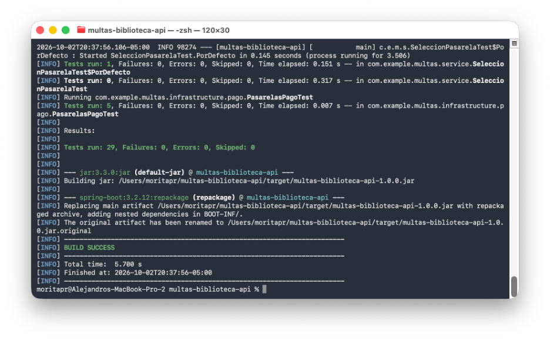
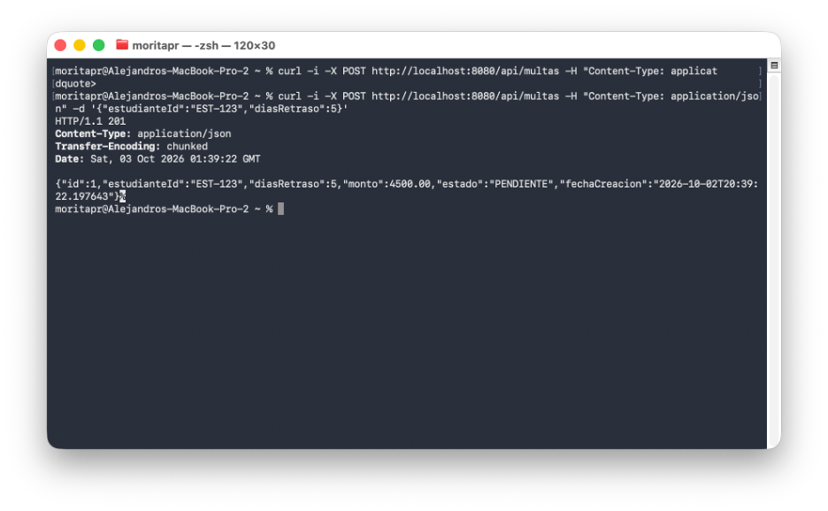
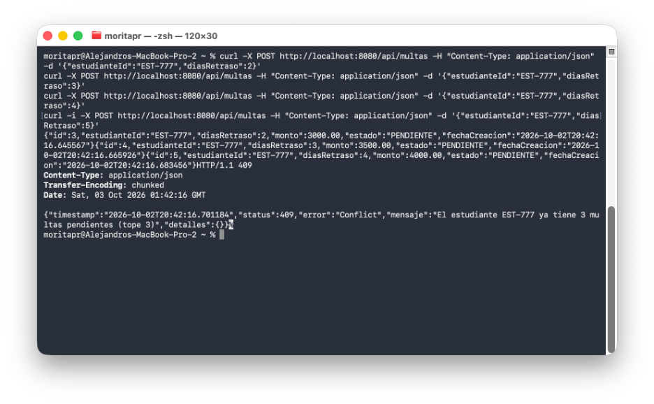
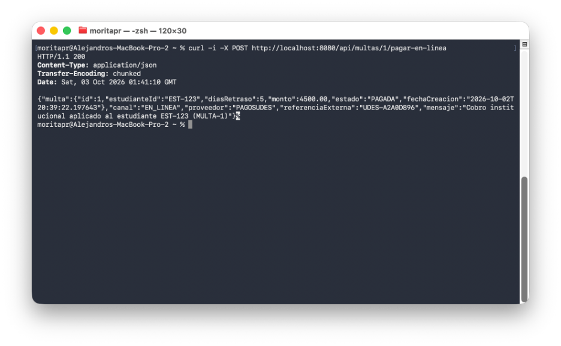
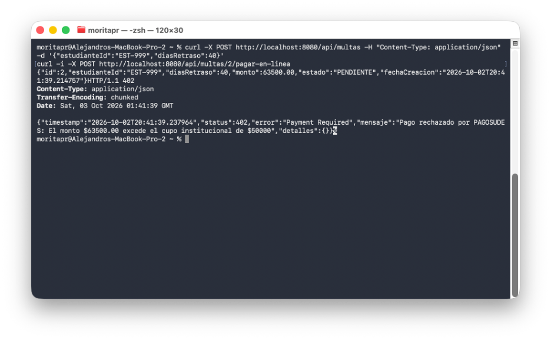
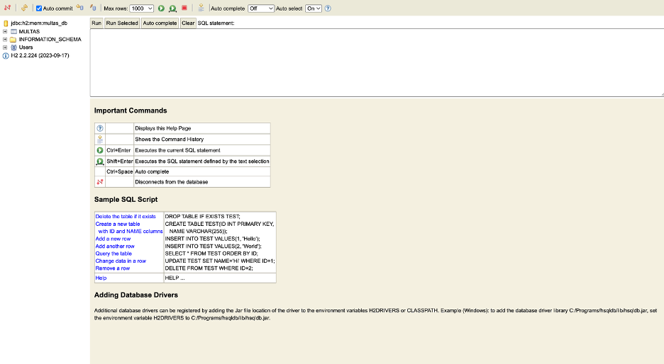

# multas-biblioteca-api

**Unidad 7 – Patrones Arquitectónicos I: Sistema de Gestión de Multas de Biblioteca**

API REST para generar, consultar y pagar multas por retraso en la devolución de libros. Combina una
arquitectura por capas (controller → service → repository) con un **puerto hexagonal** para las
pasarelas de pago, de modo que el proveedor (PagosUDES o Wompi) se cambia solo por configuración.

- Java 17 · Spring Boot 3.2.12 · Maven
- Spring Web, Spring Data JPA, Bean Validation, H2 en memoria, Lombok
- JUnit 5 + MockMvc (29 pruebas)

## Ejecución

```bash
# compilar y correr todas las pruebas
mvn clean package

# levantar la API en http://localhost:8080
mvn spring-boot:run

# usar Wompi en lugar de PagosUDES
mvn spring-boot:run -Dspring-boot.run.arguments=--app.pagos.proveedor=wompi
```

Consola H2: http://localhost:8080/h2-console — JDBC URL `jdbc:h2:mem:multas_db`, usuario `sa`, sin contraseña.

> Con JDK 23 o posterior, el `pom.xml` ya fija Lombok 1.18.42 (con `annotationProcessorPaths`) y Byte Buddy 1.17.8
> para que el proyecto compile y las pruebas corran. También se verificó con JDK 17.

## Reglas de negocio

| Regla | Dónde vive |
|---|---|
| Monto = base $2.000 + tarifa progresiva: días 1–7 a $500, días 8–15 a $1.000, día 16 en adelante a $2.000 | `Multa.calcularMonto()` |
| Un estudiante no puede tener más de **3 multas PENDIENTES** → 409 | `MultaService.generarMulta` + `countByEstudianteIdAndEstado` |
| Una multa pagada no se puede volver a pagar → 409 | `Multa.marcarPagada()` |
| PagosUDES rechaza cobros mayores a $50.000; Wompi rechaza más de 5.000.000 centavos → 402 | adaptadores en `infrastructure/pago` |

Ejemplos: 10 días = $8.500 · 20 días = $23.500 · 40 días = $63.500 (lo rechazan ambas pasarelas).

## Endpoints

| Método | Ruta | Respuesta |
|---|---|---|
| POST | `/api/multas` | 201 multa creada · 400 datos inválidos · 409 tope de pendientes |
| GET | `/api/multas` | 200 todas las multas |
| GET | `/api/multas/estudiante/{estudianteId}` | 200 multas del estudiante |
| POST | `/api/multas/{id}/pagar-en-ventanilla` | 200 · 404 no existe · 409 ya pagada |
| POST | `/api/multas/{id}/pagar-en-linea` | 200 · 402 cobro rechazado · 404 · 409 |

## Estructura de paquetes

```
com.example.multas
├── MultasBibliotecaApplication
├── controller/        MultaController                      ← adaptador de entrada (REST)
├── dto/               GenerarMultaRequest, MultaResponse, PagoResponse
├── service/           MultaService                         ← casos de uso; depende de abstracciones
├── model/             Multa (entidad rica), EstadoMulta
├── repository/        MultaRepository (JpaRepository)
├── domain/            ResultadoPago, PagoRechazadoException ← Java puro
│   └── port/          PasarelaPagoPort                     ← puerto de salida (sin Spring)
├── infrastructure/
│   └── pago/          PagosUdesAdapter, WompiAdapter       ← adaptadores de salida
└── exception/         GlobalExceptionHandler, RecursoNoEncontradoException, ErrorResponse
```

```
HTTP ──► MultaController ──► MultaService ──► MultaRepository ──► H2
                                   │
                                   └──► PasarelaPagoPort (interfaz del dominio)
                                              ▲              ▲
                                   PagosUdesAdapter     WompiAdapter
                               (app.pagos.proveedor=pagosudes | wompi)
```

## Decisiones de diseño

**Punto de decisión 1 – El cálculo del monto vive en la entidad.**
`Multa.calcularMonto()` es lógica de dominio pura: depende solo de los días de retraso. Dejarla en la
entidad (modelo rico) evita un modelo anémico, la hace probable sin Spring ni base de datos
(`MultaTest`) y garantiza que toda multa se cree con el monto correcto, porque el constructor lo calcula.
Lo mismo aplica a la transición de estado: `marcarPagada()` impide pagar dos veces.

**Punto de decisión 2 – El tope de 3 pendientes se valida con un conteo en SQL.**
`countByEstudianteIdAndEstado` se traduce a `SELECT COUNT(...) WHERE estudiante_id = ? AND estado = ?`.
No se cargan las entidades en memoria para filtrarlas con streams: el costo es constante sin importar
cuántas multas históricas tenga el estudiante. La regla se aplica en el servicio porque involucra varias
multas (no es invariante de una sola entidad) y responde 409 Conflict.

**Punto de decisión 3 – Puerto de pago en Java puro dentro del dominio.**
`PasarelaPagoPort` y `ResultadoPago` no importan nada de Spring ni del proveedor. El servicio depende
de la abstracción (inversión de dependencias); los detalles propios de cada proveedor, como los
centavos de Wompi o el cupo institucional de PagosUDES, quedan encerrados en su adaptador. Un rechazo
del proveedor se traduce a una excepción de dominio (`PagoRechazadoException`), que el handler global
convierte en 402 Payment Required sin conocer al proveedor.

**Punto de decisión 4 – El adaptador se elige por configuración con `@ConditionalOnProperty`.**
Solo se registra un bean de `PasarelaPagoPort`, según `app.pagos.proveedor`. PagosUDES es el valor por
defecto (`matchIfMissing = true`). Cambiar de proveedor es cambiar una propiedad, sin tocar el
servicio ni el controlador. `SeleccionPasarelaTest` y `MultaControllerWompiTest` lo verifican
levantando el contexto con cada valor.

### Trade-off considerado

| | Opción A: servicio acoplado al proveedor | Opción B: estrategia con selección en tiempo de ejecución | **Opción C: puerto + adaptadores por configuración (elegida)** |
|---|---|---|---|
| Cómo funciona | `MultaService` instancia o llama directamente a PagosUDES/Wompi con `if/else` | Todos los adaptadores son beans; un `Map<String, Pasarela>` o una factory escoge en cada petición | Un único bean activo, elegido al arrancar con `@ConditionalOnProperty` |
| Agregar proveedor | Modificar el servicio (viola OCP) | Nuevo bean + registrar clave | Nuevo adaptador + valor de propiedad |
| Pruebas del servicio | Difíciles: arrastra el SDK del proveedor | Buenas | Buenas: el puerto se sustituye por cualquier implementación |
| Dominio independiente | No | Parcial: suele filtrarse el selector | Sí: el puerto es Java puro |
| Varios proveedores a la vez | — | **Sí** (p. ej. que el estudiante elija) | No: uno por despliegue |
| Complejidad | Baja al inicio, crece con cada proveedor | Media | Baja |

**Justificación:** el requisito es que la institución opere con **una** pasarela por despliegue y pueda
migrar de una a otra. La opción C cubre eso con la menor complejidad y mantiene el dominio aislado. Se
acepta como costo no poder ofrecer dos pasarelas simultáneas. Si en el futuro el estudiante debe elegir
el medio de pago, se evolucionaría hacia la opción B sin modificar el puerto ni los adaptadores, porque
solo cambia cómo se seleccionan.

## Evidencia de Ejecución (Capturas de Pantalla)

Las imágenes se guardan en [`docs/`](docs/):

| # | Evidencia | Archivo |
|---|---|---|
| 1 | `mvn clean package` con BUILD SUCCESS y 29 pruebas |  |
| 2 | Aplicación iniciada (`mvn spring-boot:run`) |  |
| 3 | POST generar multa → 201 |  |
| 4 | Cuarta multa pendiente → 409 |  |
| 5 | Pago en línea con PagosUDES → 200 |  |
| 6 | Pago en línea con Wompi (`app.pagos.proveedor=wompi`) → 200 |  |
| 7 | Cobro rechazado → 402 |  |
| 8 | Consola H2 con la tabla `MULTAS` |  |

### Pruebas con curl

```bash
# 1. Generar multa (10 días -> $8.500) -> 201
curl -i -X POST http://localhost:8080/api/multas \
  -H "Content-Type: application/json" \
  -d '{"estudianteId":"EST-001","diasRetraso":10}'

# 2. Validación de entrada -> 400
curl -i -X POST http://localhost:8080/api/multas \
  -H "Content-Type: application/json" \
  -d '{"estudianteId":"","diasRetraso":0}'

# 3. Tope de pendientes: la 4.ª multa de EST-002 -> 409
for i in 1 2 3 4; do
  curl -s -o /dev/null -w "%{http_code}\n" -X POST http://localhost:8080/api/multas \
    -H "Content-Type: application/json" -d '{"estudianteId":"EST-002","diasRetraso":2}'
done

# 4. Listar todas / por estudiante
curl http://localhost:8080/api/multas
curl http://localhost:8080/api/multas/estudiante/EST-002

# 5. Pagar en ventanilla -> 200 (repetirlo -> 409)
curl -i -X POST http://localhost:8080/api/multas/2/pagar-en-ventanilla

# 6. Pagar en línea -> 200 (proveedor según app.pagos.proveedor)
curl -i -X POST http://localhost:8080/api/multas/1/pagar-en-linea

# 7. Cobro rechazado: 40 días -> $63.500 supera el cupo -> 402
curl -s -X POST http://localhost:8080/api/multas \
  -H "Content-Type: application/json" -d '{"estudianteId":"EST-003","diasRetraso":40}'
curl -i -X POST http://localhost:8080/api/multas/5/pagar-en-linea

# 8. Multa inexistente -> 404
curl -i -X POST http://localhost:8080/api/multas/999/pagar-en-linea
```

Ejemplo de respuesta 402:

```json
{"timestamp":"...","status":402,"error":"Payment Required",
 "mensaje":"Pago rechazado por PAGOSUDES: El monto $63500.00 excede el cupo institucional de $50000","detalles":{}}
```

## Pruebas automatizadas

| Clase | Qué valida |
|---|---|
| `model/MultaTest` | Cálculo progresivo del monto, estado inicial, doble pago, datos inválidos |
| `repository/MultaRepositoryTest` | `countByEstudianteIdAndEstado` y `findByEstudianteId` (`@DataJpaTest`) |
| `infrastructure/pago/PasarelasPagoTest` | Ambos adaptadores cumplen el mismo contrato del puerto; conversión a centavos de Wompi |
| `service/SeleccionPasarelaTest` | `@ConditionalOnProperty` activa PagosUDES por defecto y Wompi con la propiedad |
| `controller/MultaControllerTest` | Endpoints con MockMvc: 201, 400, 404, 409 (tope y doble pago), 402, liberación de cupo |
| `controller/MultaControllerWompiTest` | Mismo endpoint de pago con Wompi: 200 y 402 |
